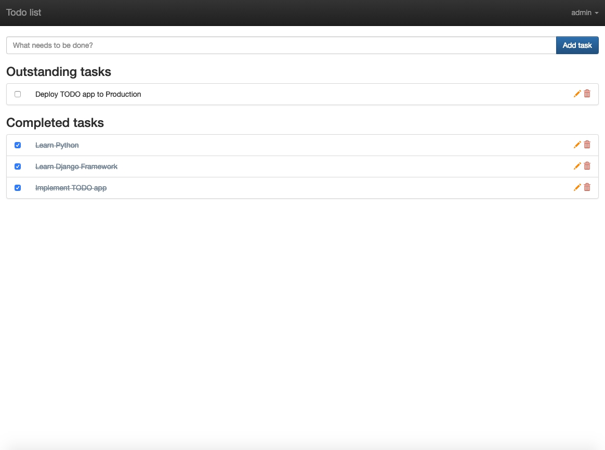

# Django - To Do

Implementation of To Do list using the Django framework

## Demo



## Setting Up

### Install

* Python (v3.7.2 or higher)

### Then

```
$ pip install virtualenv
$ cd django-todo
$ virtualenv .
$ cd bin
$ source activate
$ cd ..
$ pip install -r requirements.txt
$ export DJANGO_SETTINGS_MODULE=todo.settings.dev
$ python manage.py migrate
$ python manage.py runserver
```

## Production

In production mode you should use production settings config

`DJANGO_SETTINGS_MODULE=todo.settings.production`

## Admin section

Admin section is available by `/admin/` path.

## Rest API docs

Rest API docs is available by `/api/docs/` path.

## OAuth authorization

OAuth authorization library docs is available [here](https://django-oauth-toolkit.readthedocs.io/en/0.12.0/)

## Developed By

Dmitry Kologrivko  - <dmitrykologrivko@gmail.com>
